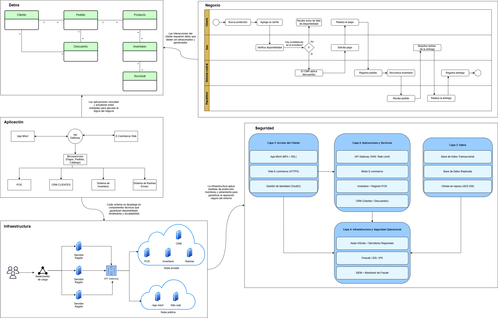

# 🗒️ Registro de Trabajo en Clase - Taller 7

## 📆 Fecha de la sesión
 8 de noviembre de 2025

## 👥 Integrantes presentes
- Samuel Espitia  
- Nicolas Ortiz
- Edwin Gutierrez 

## 🧠 Actividades realizadas en clase

Durante la sesión el equipo avanzó en el diseño e integración de las vistas arquitectónicas requeridas para el taller:

- Se discutió la estructura general del modelo de arquitectura de FarmApp y se definió la distribución del trabajo por vistas.
- **Nicolás** desarrolló la **vista de Aplicación**, modelando los componentes, integraciones y la relación entre los sistemas principales.
- **Samuel** construyó las vistas de **Negocio, Información e Infraestructura**, levantando los procesos clave, las entidades centrales y la distribución tecnológica de soportes.
- **Edwin** elaboró la **vista de Seguridad**, definiendo controles de autenticación, cifrado, segmentación, monitoreo y protección de datos.
- Se tomaron decisiones para unificar criterios de nomenclatura, colores y estilo visual en todas las vistas.
- Se utilizó **Draw.io** como herramienta principal, complementando con esquemas preliminares en la pizarra.
- Se acordó que **Nicolás y Edwin** integrarían todas las vistas en un solo documento coherente para la entrega final.

---

## 🧩 Boceto del modelo

> 

---

## 🔁 Tareas definidas para complementar el taller

| Tarea asignada                                 | Responsable        | Fecha estimada |
|------------------------------------------------|--------------------|----------------|
| Redacción del informe y vista de Aplicacion     | Nicolás Ortiz      | 10/11 |
| Redacción del informe y vista de seguridad      | Edwin Gutierrez    | 11/11 |
| Vistas de infraestructura, datos y negocio      | Samuel Espitia     | 12/11 |
| Unión y consistencia del documento final        | Nicolás & Edwin    | 12/11 |

---

## 🔗 Importancia y conexión entre las vistas trabajadas

La arquitectura empresarial requiere que cada vista aporte una perspectiva específica y que, juntas, formen un modelo coherente que represente adecuadamente a FarmApp. En este taller, cada vista cumplió un rol clave:

### 🔹 Vista de Negocio 
Define los procesos esenciales de FarmApp como compra, despacho y prescripción.  
Sirve como punto de partida para las demás vistas, ya que clarifica qué capacidades debe soportar la arquitectura.

### 🔹 Vista de Información 
Identifica entidades clave como Cliente, Producto, Pedido e Inventario.  
Garantiza la coherencia y disponibilidad de los datos que los procesos del negocio requieren.

### 🔹 Vista de Infraestructura 
Describe el entorno técnico donde operan las aplicaciones: nube híbrida, servidores y redes.  
Permite validar rendimiento, disponibilidad y escalabilidad.

### 🔹 Vista de Aplicación 
Modela los sistemas y servicios que implementan los procesos del negocio: app móvil, e-commerce, POS, CRM y APIs.  
Es el puente entre lo que el negocio necesita y la infraestructura que lo soporta.

### 🔹 Vista de Seguridad 
Define los controles que protegen los datos, aplicaciones e infraestructura: MFA, cifrado, firewalls, segmentación y monitoreo.  
Asegura que los servicios de FarmApp funcionen de manera confiable y cumplan con buenas prácticas.

---

## 🔄 Conexión general entre las vistas

- La **vista de negocio** establece los requerimientos fundamentales.  
- La **vista de información** describe los datos necesarios para ejecutar esos procesos.  
- La **vista de aplicación** implementa esos procesos y manipula esos datos.  
- La **vista de infraestructura** provee el ambiente en el que corren esas aplicaciones.  
- La **vista de seguridad** protege todos los anteriores de manera transversal.

Estas vistas, integradas, proporcionan un entendimiento completo y alineado del funcionamiento de FarmApp.
---

_Este documento resume el trabajo colaborativo realizado durante la sesión del taller 7 en el curso AREM - Universidad de La Sabana._
