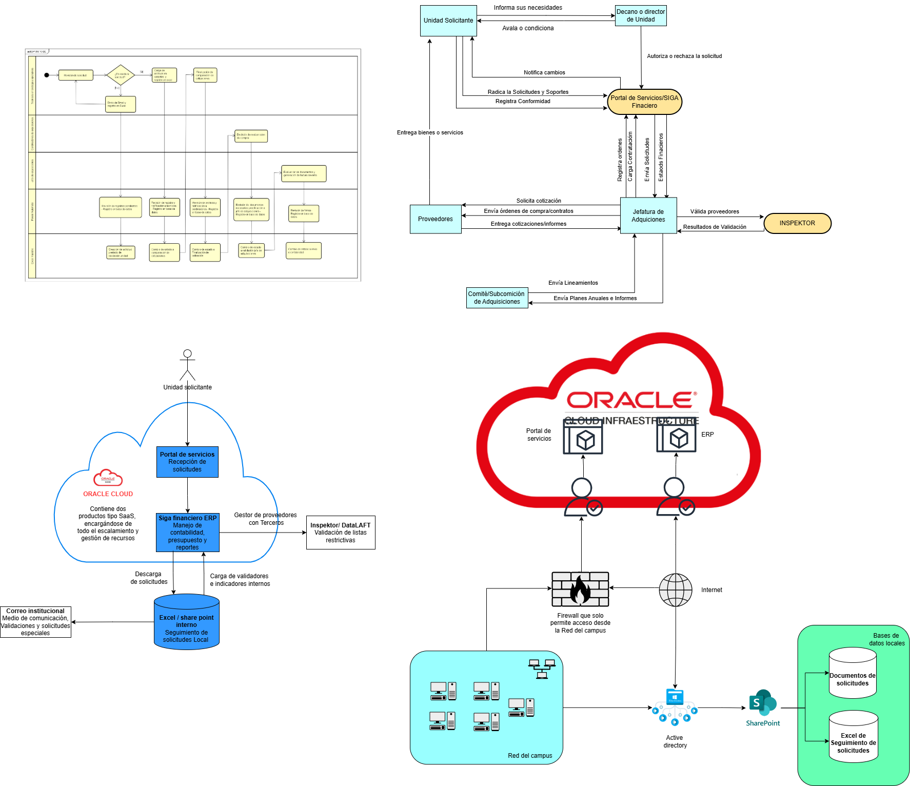

# 📄 Informe Técnico del Taller

## 🔖 Nombre del Taller
_Taller 7 - Taller-07-Integracion-Vistas

## 👥 Integrantes del equipo
- Edwin Alejandro Gutierrez Rodriguez edwingutro@unisabana.edu.co
- Samuel Espitia Cruz samuelescr@unisabana.edu.co
- Nicolas Stiven Ortiz Cortes nicolasorco@unisabana.edu.co
  
# 🧠 Descripción general del trabajo

El objetivo del taller fue integrar múltiples vistas arquitectónicas —proceso, negocio, aplicaciones, infraestructura y seguridad— para modelar el funcionamiento del proceso de **Adquisiciones Institucionales** en la Universidad de La Sabana.  
El ejercicio buscó representar de forma integrada cómo interactúan las unidades solicitantes, la jefatura de adquisiciones, los proveedores, los sistemas corporativos (ERP, portal de servicios, INSPEKTOR, SharePoint), y la infraestructura tecnológica que sostiene todo el proceso.

El trabajo se desarrolló partiendo de los flujos actuales del proceso, identificando los actores involucrados y consolidando los diagramas en un solo modelo visual coherente.

---

# 🔧 Proceso de desarrollo

El equipo inició revisando el proceso administrativo modelado en BPMN, lo cual permitió identificar las tareas principales del ciclo de adquisiciones: solicitud, aprobación, validación, cotización y entrega.

A partir de este proceso se tomaron las siguientes decisiones:

- **Modelar primero la vista de negocio**, basada en actividades y actores.
- Integrar gradualmente la **vista de aplicaciones**, destacando:
  - Portal de Servicios  
  - Siga Financiero ERP  
  - Gestor de Proveedores  
  - INSPEKTOR para validación DataIFLT  
  - Excel/SharePoint como soporte documental  
- Posteriormente agregar la **vista de infraestructura**, identificando:
  - Oracle Cloud como plataforma principal del ERP  
  - Firewall institucional  
  - Red del campus  
  - Active Directory  
- Se construyó el diagrama integrado en **Draw.io**, ajustando colores, conexiones y posiciones para mantener claridad visual.

El desarrollo fue iterativo, ajustando los componentes conforme se validaba su rol dentro del proceso.

---

# 🧩 Análisis del modelo propuesto

### ✔ Estructura del modelo

El diagrama se organiza en secciones que representan:

1. El flujo del proceso (BPMN).  
2. La interacción entre unidades administrativas (solicitante, decano, adquisiciones).  
3. Los sistemas que soportan el proceso (ERP, portal, INSPEKTOR, SharePoint).  
4. La infraestructura tecnológica (Oracle Cloud, red corporativa, firewall).  

### ✔ Representación de necesidades del cliente

El modelo refleja adecuadamente la operación del área de Adquisiciones, incluyendo:

- Recepción centralizada de solicitudes desde el **Portal de Servicios**.  
- Validación y control financiero en **Siga ERP**.  
- Validación de proveedores mediante **INSPEKTOR**.  
- Comunicación entre unidades solicitantes, adquisiciones y proveedores.  
- Infraestructura segura para acceso y procesamiento mediante firewall y herramientas institucionales.

---

# 📈 Diagrama final entregado

---

# 📋 Tabla de actores, entidades o componentes

| Nombre del elemento        | Tipo             | Descripción                                                 | Responsable |
|----------------------------|------------------|-------------------------------------------------------------|-------------|
| Unidad Solicitante         | Actor            | Genera la solicitud de bienes o servicios                   | Área usuaria |
| Decano / Director de Unidad | Actor           | Revisa, aprueba o condiciona las solicitudes                | Dirección académica |
| Jefatura de Adquisiciones  | Actor            | Gestiona proveedores, validaciones y cotizaciones           | Adquisiciones |
| Proveedores                | Actor            | Envían cotizaciones y entregan bienes o servicios           | Externo |
| Portal de Servicios        | Aplicación       | Módulo de recepción y radicación de solicitudes             | TI |
| Siga Financiero ERP        | Aplicación       | Control presupuestal y financiero de adquisiciones          | Área financiera |
| Gestor de Proveedores      | Aplicación       | Gestión documental y validación preliminar de proveedores   | Adquisiciones |
| INSPEKTOR / DataIFLT       | Servicio externo | Validación de listas restrictivas y cumplimiento            | Cumplimiento |
| Excel / SharePoint         | Repositorio      | Archivo local de solicitudes, reportes y validaciones       | Usuarios internos |
| Firewall institucional     | Infraestructura   | Protege la red corporativa y regula tráfico con Internet    | TI |
| Red del Campus             | Infraestructura   | Conectividad institucional para los sistemas internos       | TI |
| Active Directory           | Infraestructura   | Autenticación centralizada del personal universitario       | TI |
| Oracle Cloud               | Infraestructura   | Plataforma donde residen ERP y portal institucional         | TI |

---

## 🔍 Investigación complementaria
### Tema investigado:
Ejemplos reales de documentación de vistas

### Resumen:
La revisión de casos reales de arquitectura empresarial evidencia que múltiples organizaciones utilizan documentación basada en vistas para modelar su ecosistema tecnológico de forma estructurada. Empresas como General Motors han desarrollado vistas compuestas que integran capas de negocio, información, aplicaciones y tecnología, con el fin de alinear capacidades estratégicas con su arquitectura TI corporativa. Este enfoque permite visualizar relaciones entre procesos y sistemas, facilitando la toma de decisiones sobre modernización e interoperabilidad. De manera similar, en el sector industrial, ACTIA Automotive ha implementado mapeos de arquitectura que organizan y relacionan vistas de procesos, aplicaciones e infraestructura para gestionar la complejidad del portafolio tecnológico y mejorar la eficiencia operativa.

En el sector público y en organizaciones de servicios, también se encuentran ejemplos relevantes. La Secretaría de Salud de Carepa (Colombia) ha aplicado el marco TOGAF para documentar vistas de negocio, datos, aplicaciones y tecnología como base para su transformación digital. De igual forma, estudios recientes muestran cómo la arquitectura empresarial puede emplearse para optimizar procesos —como el proceso de ventas— a través de vistas integradas de negocio, información y sistemas. Finalmente, el National Enterprise Architecture Framework (NEAF) del Reino de Bahréin constituye un caso a gran escala donde se documentan vistas institucionales, de datos, aplicaciones, infraestructura y gobernanza, demostrando la aplicabilidad de este tipo de documentación incluso a nivel nacional.

En conjunto, estos casos muestran cómo diferentes sectores utilizan la documentación de vistas arquitectónicas para estructurar su modelo organizacional y tecnológico. La integración de vistas permite comprender mejor la interacción entre procesos, datos, aplicaciones e infraestructura, lo cual es directamente aplicable al taller de FarmApp, donde se requiere representar cómo cada capa soporta los objetivos del negocio y contribuye a la operación integral del ecosistema

## 📚 Referencias
- [1] EACOE, “Enterprise Architecture Case Studies,” EACOE, General Motors. Disponible en: https://www.eacoe.org/enterprise-architecture-case-studies/
- [2] My-Carto, “IT Landscape Mapping at Actia Automotive,” My-Carto Case Studies, 2023. Disponible en: https://my-carto.com/en/case-studies/case-study-it-landscape-mapping-at-actia-automotive/
- [3] M. Lemus, “Arquitectura Empresarial para la Secretaría de Salud del Municipio de Carepa,” Universidad Nacional Abierta y a Distancia (UNAD), 2021. Disponible en: https://repository.unad.edu.co/bitstream/handle/10596/43392/mdlemush.pdf
- [4] C. G. Arango and A. D. Coleman, “Modelo de Arquitectura Empresarial basado en TOGAF para una empresa del sector transporte,” Universidad Privada del Norte, 2022. Disponible en: https://repositorio.upn.edu.pe/bitstream/handle/11537/33367/Arango%20Melgar%2C%20Carlos%20Gabriel%20-%20Coleman%20Caceres%2C%20Aylen%20Daiana.pdf
- [5] P. Ribeiro et al., “Enterprise Architecture to Optimize the Sales Process,” in Proceedings of the 19th International Conference on Enterprise Information Systems, SCITEPRESS, 2024. Disponible en: https://www.scitepress.org/Papers/2024/129285/129285.pdf
- [6] A. Alkhalifa, “National Enterprise Architecture Framework: Case Study of EA Development in the Kingdom of Bahrain,” ResearchGate, 2016. Disponible en: https://www.researchgate.net/publication/293298773_National_Enterprise_Architecture_Framework_Case_Study_of_EA_Development_Experience_in_the_Kingdom_of_Bahrain

---

_Este documento hace parte de la entrega del taller 7 del curso AREM (Arquitectura Empresarial) - Universidad de La Sabana._
